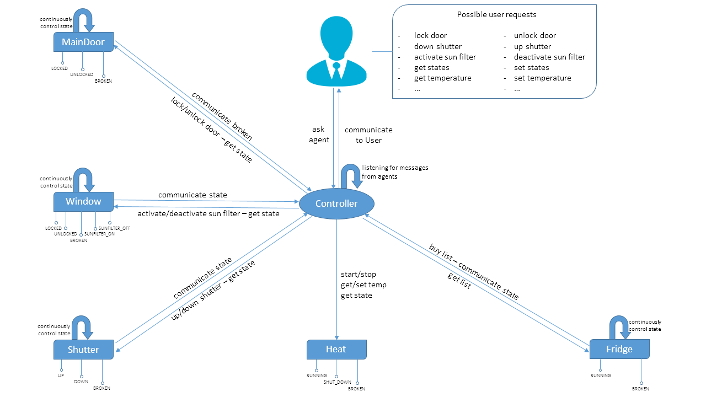
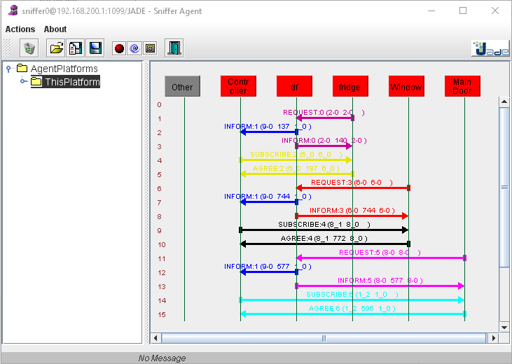
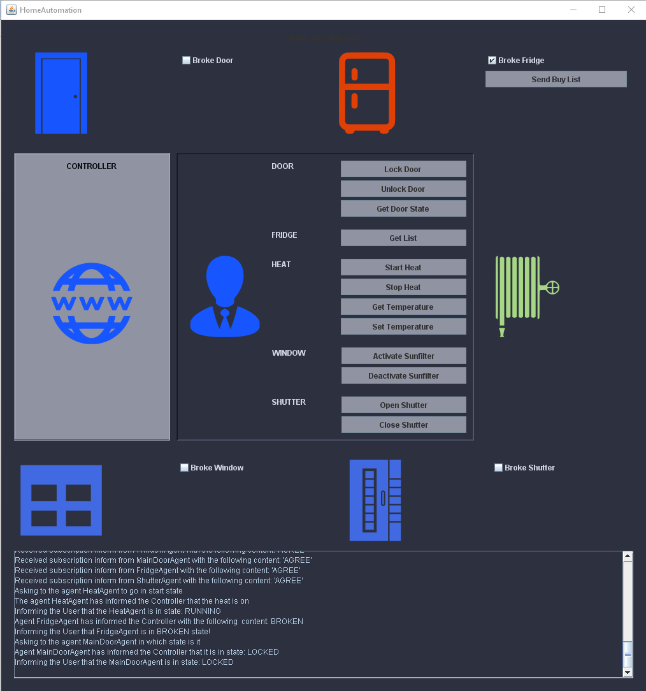

# Multi Agent Systems Project
## Home Automation Multi Agent System

## Project Description
This project has as objective the implementation of a Home Automation System using a Multi Agent System approach, and it is 
actuated with the help of the JADE framework. In particular, I consider entities like doors, windows, fridge, etc., and I 
conceptualize them as Agents that interact with each other. 

The interaction is guided by a ControllerAgent, which can be seen as the Master in a Master-Slave architecture. The user 
interacts with the system by making requests to the ControllerAgent, and the system gives feedback and notifications to 
the User, also through the ControllerAgent.

The system has three types of agents:
- agents that are an access point into the house, which means that if someone wants to break into the house it has to do it through those agents (e.g. door, window, shutter). I’m going to refer to these agents as control-agents;
- agents that are not an access point into the house (e.g. heat, fridge). I’m going to refer to these agents as not-control-agents;
- the ControllerAgent which I described above.

The control-agents have to continuously control their state in order to reveal if someone broke into the house, meanwhile 
the not-control-agents don’t have this characteristic. The FridgeAgent is a particular case of not-control-agent that has 
to continuously control his state because it has to inform the User if it is broken and the food goes bad.

Each agent has a certain number of states in which it can be. Figure 1 presents the architecture of the system, and for
 each agent, the states in which it can be. To better understand the system, I consider the following interaction example: 

*We have the DoorAgent which is in the LOCKED state. If someone forces the door, the DoorAgent enters a BROKEN state and 
thus has to inform the ControllerAgent that someone has broken into the house. The ControllerAgent will immediately 
inform the User about the event.*

One thing to notice is that the system could also be implemented without the ControllerAgent (the DoorAgent directly 
informs the User about the event), but I chose the current implementation because I think is more flexible. This 
architecture could be defined as a centralized architecture that has the main drawback that if the ControllerAgent 
does not work, the whole system will stop working. I think that the way the code is written allows a quite easy addition 
of a redundant ControllerAgent, which can take the place of the broken one if needed. The whole implementation is based, 
as expected, on message passing between the ControllerAgent and the rest of the agents, and the ControllerAgent and the User. 

The User interaction with the system could be provided via a mobile application, but this is outside the scope of the project.
I choose to develop the project using an IDE, in particular the Intelij Idea, which allows a very quick and easy link 
with the JADE framework, execution of the agents, and creation of an executable file. This obviously is not mandatory 
to execute the project.

## Project Implementation
### Project setup
The first stage of the project was to implement the ControllerAgent and the DoorAgent and make them communicate. So I 
created two classes that extend the Agent class from JADE framework, one for the ControllerAgent and one for the DoorAgent. 
I then implemented some basic behaviour for each of them, which consisted of ControllerAgent sending a message to the 
DoorAgent, and the DoorAgent answering back. Once I had up and running these two agents I had the template for developing 
the whole project.
 
The next step in this stage was to declare all the classes for the remaining agents. I also declared an interface, called 
HomeAutomation, which will be implemented by all the agents and it will contain the fields that have to be accessed 
globally by the agents. Next, I declared a utility class that will contain static methods that are used by the agents. 
An example of a utility method is the registration of a service to the DFServices by the agent. Since all the agents 
have to subscribe some services, I decided to declare a unique method that can be used by all the agents.

### Agents Implementation

In this step, I define some basic behaviours for all the agents (as for the ControllerAgent and the DoorAgent). This 
gave me a clearer view of how the system has to interact and what are the interactions that are required. I also 
declared in the HomeAutomation interface and Enum for each agent which contains the states in which the agent can 
be (see Figure 1 for the states). Another thing I did, was to add a utility method that interrogates the DFService, 
for all the agents that provide a certain service. The first approach for the implementation of the control-agents 
behaviour, was to declare a TickerBehaviour, which will control every x seconds the state of the agent, and if it was 
in the broken state then send a message to the ControllerAgent. 

After some analysis, I understood that a better approach could be used. In particular, I could attach a listener to the
 agent state variable and as soon as it changes its value to BROKEN, send the message to the ControllerAgent. 

The logic that I used is the following: the ControllerAgent subscribes to the DFService in order to be notified for agents
 that offers services of type “control-service”. When the ControllerAgent is notified that there is a new agent that offer 
 the specified service, it makes a subscription to that agent, in particular, it subscribes to be notified when the agent 
 is in the BROKEN state. The image bellow presents the mentioned interaction.

As we can see from the above image, when a new agent is launched, it makes a request to the df to register the services 
that provides. As soon as the df agent receives a request of type “control-service”, it sends an inform to the 
ControllerAgent that there is a new agent to subscribe to. Then the ControllerAgent sends the subscription request 
to the agent indicated by the df agent. I used JADE implementation of the FIPA-Subscribe protocol for implementing 
the above behaviour. In particular, I used the SubscriberInitiator and SubscriberResponder classes. So I create a class 
that extends the SubscriberInitiator and use it to make the subscription for the DFService. Then I created another one 
that extends the SubscriptionInitiator and uses it to subscribe to a particular agent. Then for each agent, I define a 
SubscriptionManager, which will handle the registration and de-registrations of the subscribers. Then I declare also for 
each agent a class that extends the SubscriptionResponder, which has the purpose of notifying 
the ControllerAgent when the agent is in a BROKEN state.

Now I had to find a way to listen to the agent state variable, in order to send the message to the ControllerAgent when 
the value of the variable is BROKEN. I did this using the Observer pattern implemented in Java. I declared a class that 
extends the Observable class and declared the agent state as an instance of that class. Then I declared a getter and a 
setter method, and on the setter method, after I change the state value, I call the setValue() and notifyObservers() methods 
in order to notify that the value has changed. 

I then created another class that implements the Observer interface and uses the update method to notify the subscribers 
that the state is BROKEN. I realized then, that I had to declare these two classes for each agent which was not very 
efficient, so I used the Generics provided by Java to instantiate them with a different agent each time. At this point, 
I also had to use Java Reflection in order to be able to call the method notifyAgents() from each SubscriptionResponder 
class. Then I updated the behaviours of the agents in order to be compliant with the above modifications. Another thing 
I did was to declare in the HomeAutomation interface the strings for identifying the requests and notifications that the 
agents send to each other.

### Graphical User Interface

I now defined a launcher class that will create and launch the JADE platform and the defined agents. In order to be able 
to interact with the agents, I had to declare an interface for each agent with the methods that the agent implements and 
register the interface with the agent using the registerO2AInterface() method. I then called the methods inside the agents 
by using the getO2AInterface() method.

Then I defined some interactive shell commands which allow me to change the agent states, in order to be able to see if 
the notifications are sent correctly (e.g. change the DoorAgent from LOCKED to BROKEN). After I saw that the behaviours 
of the agents are more or less correct, I decided to implement a Graphical User Interface which allows me to better 
simulate interactions of the User with the system, and change the agent states. The graphical interface consists of 
buttons and checkboxes through which the User makes requests to the system (see Figure 3).

As it can be seen from the bellow image the GUI is updated according to the actions that are taken. For example, if I 
mark the fridge as broken the icon change its colour from blue to orange. Another feature that I implemented was to 
redirect the System.out output to a text area integrated into the GUI. In this way, as shown in Figure 3, there is a 
real-time feedback on the messages that the agents are sending and receiving.

## Project Refactoring

The last step was to redefine the project structure by defining packages for the agents, behaviours, interfaces, and utils, 
and create a folder for the images. Once I tested the correctness of the system, I did some refactoring, in particular, 
I created a separate class for each behaviour, and declared a utility method that creates and returns a SubscriptionManager. 
I did this because most of the agents needed a SubscriptionManager, and this allows me to avoid code repetition. The same 
applies to the classes that extend the SubscriberResponder, most of the agents have to declare this class which has the 
same format for all of them. So what I did was to create only one and instantiate different objects of this class for each 
agent.

## Conclusions

The development of the project was quite linear, without major problems. I had some problems with implementing the 
FIPA-Subscribe protocol, because the JADE documentation is quite poor. I could not found any example on how the 
SubscribeInitiator and SubscribeResponder had to be extended. What I did was to look at the JADE source code implementation 
which uses this protocol in a much more complex situation. I think that the project structure is quite modular, and 
allow an easy integration and development of other agents or adding new behaviours to the existing ones. 

Due to time limits, I was not able to implement a fully consistent GUI, or handle all the combinations of the states. 
For example, if the door is in the broken state and the User sends a message to unlock it, the icon of the door changes 
to unlock, even if the door remains in the broken state. I choose to dedicate more time to the system implementation 
because I think is more related to the project than the GUI. For what concern the combination of states, for example if 
the window is opened I don’t think that I should allow to start the sun filter.

## Run the application

I will provide with the application a jar file, so in order to execute the application is sufficient to launch the jar 
file by double-clicking on it or from a console with the following command java –jar HomeAutomation.jar. 

## References
1 JADE Official Site: https://jade.tilab.com/  
2 Home Automation project on GitHub: https://github.com/AL333Z/JadeHomeAutomation  
3 JADE Tutorial and Primer: https://www.iro.umontreal.ca/~vaucher/Agents/Jade/JadePrimer.html  
4 JADE in Java – rapid tutorial: http://mateuszkaflowski.pl/java/tutorial-kaflowski-jade.pdf  
5 JADE Test Suite on Github: https://github.com/bzafiris/jade-test-suite  
6 JADE Develop Mailing List: http://jade.tilab.com/pipermail/jade-develop/2008q4/  
7 JADE material on AulaWeb: https://2020.aulaweb.unige.it/course/view.php?id=4290#section-0  
